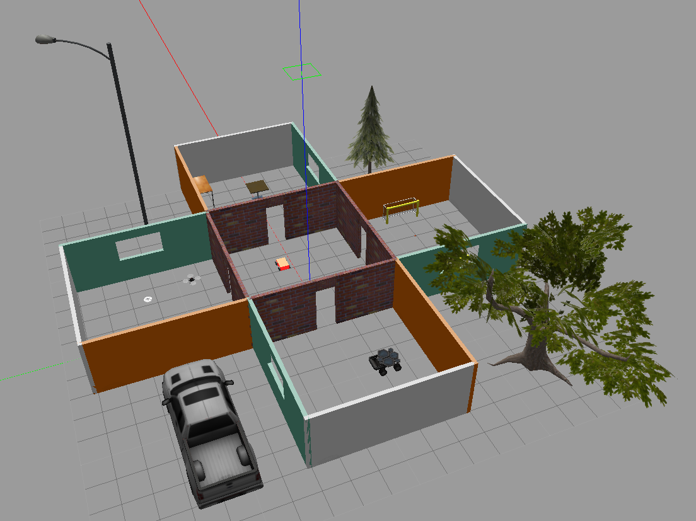
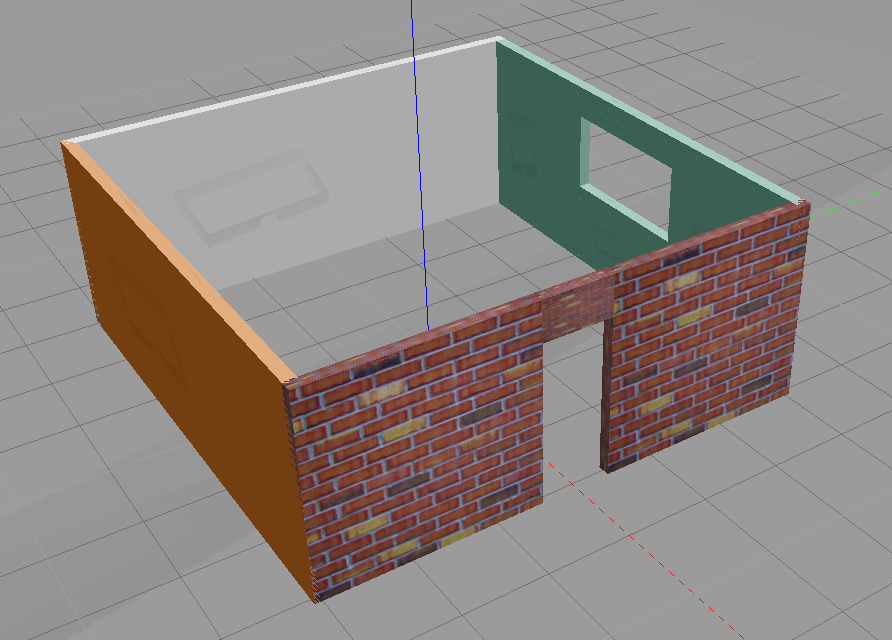
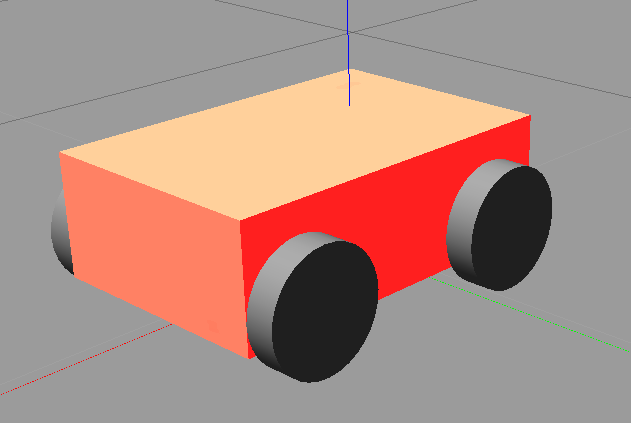
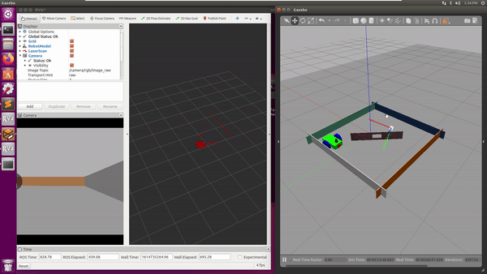

# udacity-robotics-software-engineer
### Robotics Software Engineer Nanodegree Program from Udacity

#### Configuration

VM setup on VMware Workstation 15 player

    - ubuntu 16.04 LTS
    - gazebo 7.16.1

## Project 1 - Build My World

|  |  |  |
| --- | --- | --- |

[Project 1](./project1)

## Project 2 - Go Chase It

|  |
| --- |

[Project 2](./project2)
