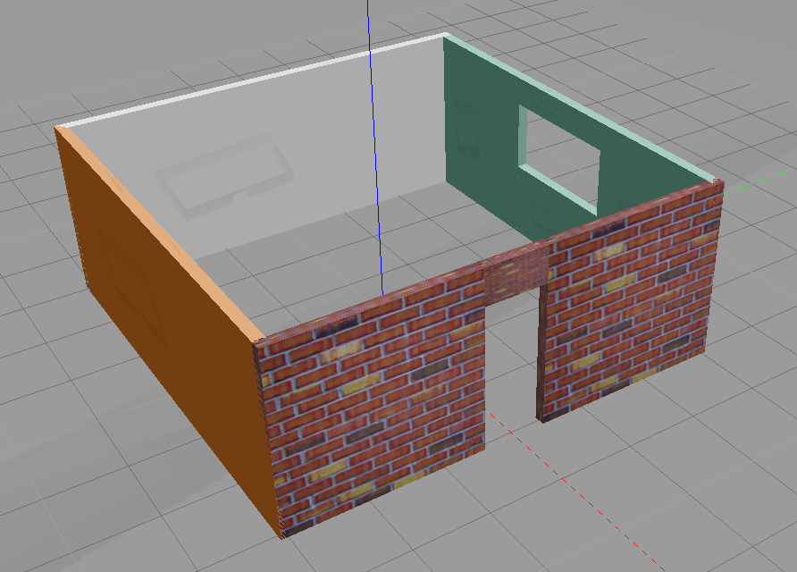
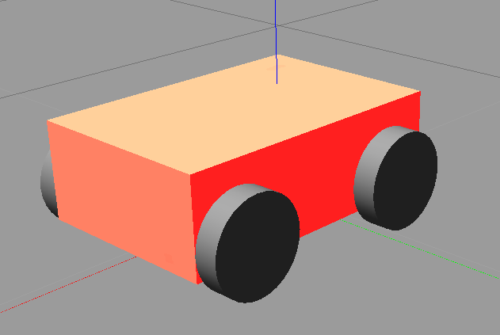

# udacity-robotics-software-engineer
### Robotics Software Engineer Nanodegree Program from Udacity

#### Configuration

VM setup on VMware Workstation 15 player

	- ubuntu 16.04 LTS
	- gazebo 7.16.1

## Project 1 - Build My World

    - [x] Add a single floor wall structure using the Building Editor tool in Gazebo.
    - [x] Model any object of your choice using the Model Editor tool in Gazebo.
    - [ ] Import your structure and two instances of your model inside an empty Gazebo World.
    - [ ] Import at least one model from the Gazebo online library and implement it in your existing Gazebo world.
    - [ ] Write a C++ World Plugin to interact with your world.

 | 

