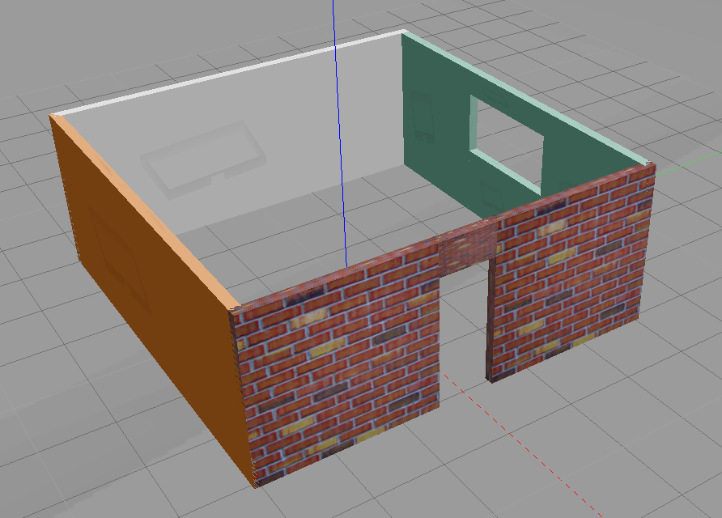
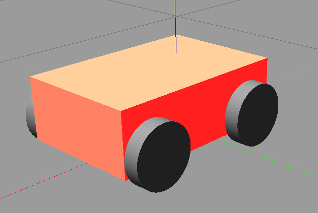

# udacity-robotics-software-engineer
### Robotics Software Engineer Nanodegree Program from Udacity

## Project 1 - Build My World

|  |  |  |
| --- | --- | --- |

    - [x] Add a single floor wall structure using the Building Editor tool in Gazebo.
    - [x] Model any object of your choice using the Model Editor tool in Gazebo.
    - [x] Import your structure and two instances of your model inside an empty Gazebo World.
    - [x] Import at least one model from the Gazebo online library and implement it in your existing Gazebo world.
    - [x] Write a C++ World Plugin to interact with your world.

### Project Setup

    - Create a build directory at the root
    - cd build
    - cmake ../
    - make
    - export GAZEBO_PLUGIN_PATH=${GAZEBO_PLUGIN_PATH}:ABSOLUTE_PATH_TO_YOUR_FOLDER/build

### Project laught
   
    - gazebo world/world
